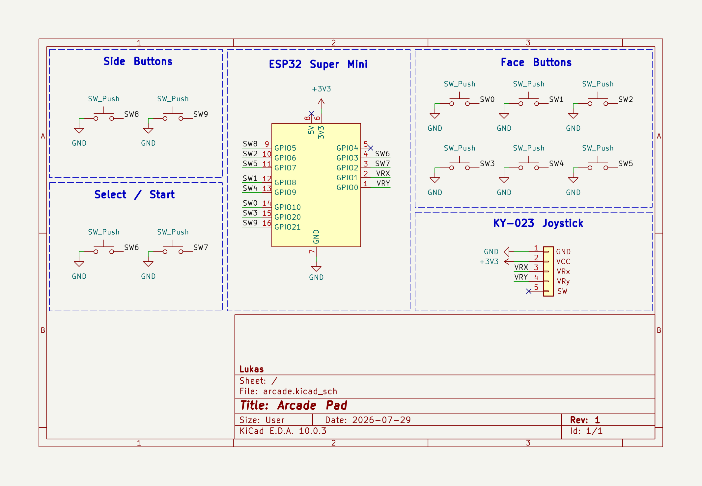
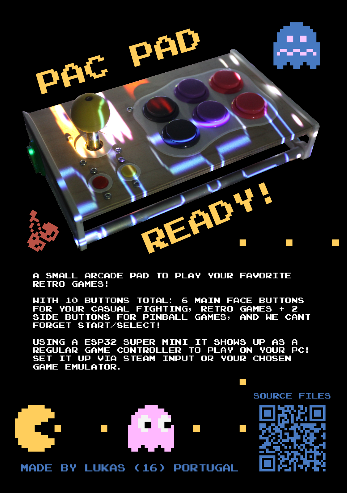

# Pac Pad

> A small arcade pad to play your favorite retro games!

---

This is a small arcade pad i designed and built with hardware i already owned so some of the parts could be better but this is what i had. The layout is a 6x2 button arrangement which covers all the retro classics, plus i added 2 extra buttons on the side for pinball games!! The joystick is just a generic analog module and not a proper arcade joystick but it does the job. For the top panel i used plywood instead of printing it to save on filament and honestly it gives it a nice little look.

for the brains it's running on a ESP32 C3 Super Mini which is not ideal because it doesn't support native USB HID, so i have to power it and connect over BLE bluetooth which adds some latency but its fine for what this is.

## Bill Of Material

| Part                                         | Quantity | Price   | Link                                                            |
|----------------------------------------------|----------|---------|-----------------------------------------------------------------|
| 30mm Arcade Button                           | 8        | $6.21   | [aliexpress](https://aliexpress.com/item/1005010285560262.html) |
| 12mm Tactile Button                          | 2        | $2.98   | [aliexpress](https://aliexpress.com/item/1005004781630944.html) |
| HW-504 Joystick Module                       | 1        | $1.81   | [aliexpress](https://aliexpress.com/item/1005006966359366.html) |
| ESP32 C3 Super Mini                          | 1        | $12.79  | [amazon](https://www.amazon.es/dp/B0DMNBWTFD)                   |
| Aluminium Tube OD: 10mm ID: 6mm Lenght 500mm | 1        | $5.73   | [aliexpress](https://aliexpress.com/item/1005011781231742.html) |
| m3x14 screws                                 | 10       | $2.23   | [aliexpress](https://aliexpress.com/item/1005005112411362.html) |
| 6.5mm Plywood ~250x150mm                     | 1        | ~$1     | Local Hardware Store                                            |
| Pin Header 3pins                             | 1        | $2.12   | [aliexpress](https://aliexpress.com/item/1005008406352332.html) |
| Silicon Wires                                | 2        | $13.51  | [aliexpress](https://aliexpress.com/item/1005005450546335.html) |
| Female to Female Jumper Cable                | 4        | $1.06   | [aliexpress](https://aliexpress.com/item/1005004631908016.html) |
| 3D Printed Parts                             | 13       | N/A     | N/A                                                             |
| **Total:**                                   |          | ~$49.44 |                                                                 |

## Flashing

```sh
pip install esptool
esptool.py --chip esp32c3 --port <port> write_flash 0x0 Firmware/Build/arcade-pad.ino.merged.bin

Replace `<port>` with your port (e.g. `COM3`, `/dev/ttyACM0`, `/dev/ttyUSB0`).
```

## Overview

| **Schematic**                       |
|:-----------------------------------:|
|   |
| **Angle View**                      |
|   |
| **Top View**                        |
|     |
| **Bottom View**                     |
|  |
| **Zine**                            |
|             |